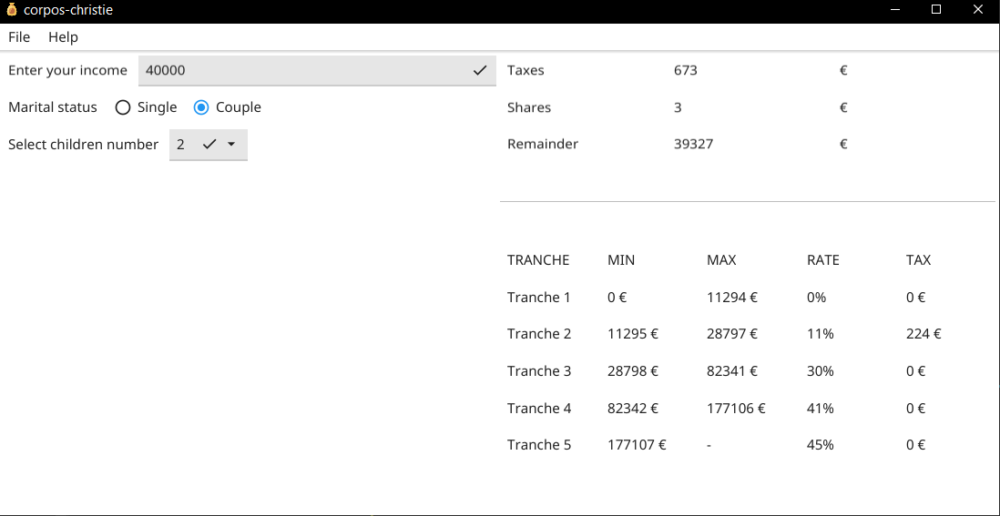
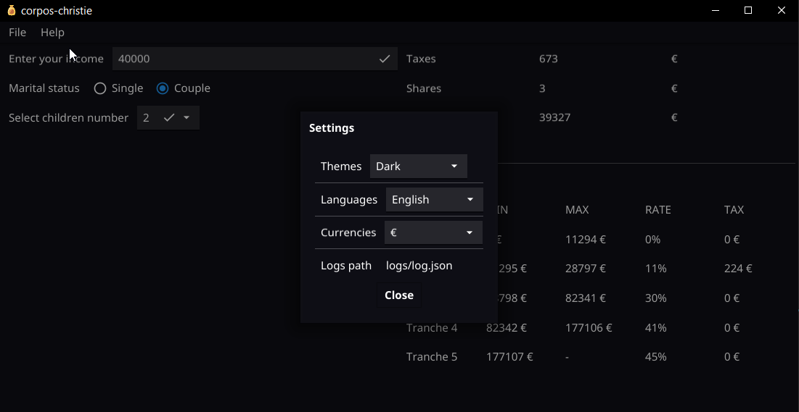
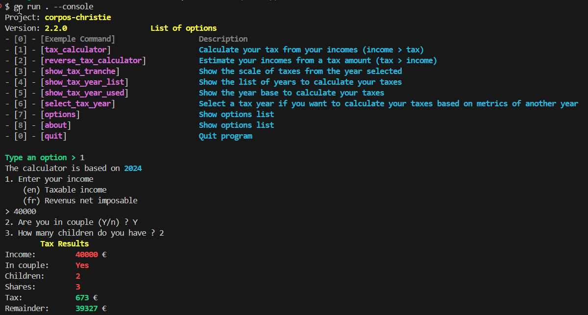

# Corpos-Christie

[](https://github.com/NY-Daystar/corpos-christie/actions)
[](https://www.gnu.org/licenses/gpl-3.0)
[](https://github.com/NY-Daystar/corpos-christie/releases)
[](https://sourcegraph.com/github.com/NY-Daystar/corpos-christie)
[](https://godoc.org/github.com/NY-Daystar/corpos-christie)


 <a href="https://codeclimate.com/github/ny-daystar/corpos-christie/maintainability"></a>  


[](#contributors)


  


Console mode


This project is an income taxes calculator
which has been developped in Golang and fyne for GUI which allows to calculate your taxes in the current year.

The government has created an explanatory sheet to understand the calculation of the tax rate but this calculation is relatively complex and we want to create a simpler interface to calculate things.  
Here's the sheet: https://www.economie.gouv.fr/particuliers/tranches-imposition-impot-revenu#etapescalculir

This project is a GUI developed with `fyne`

Source code analysed with [DeepSource](https://deepsource.com/)

## Table of contents

-   [Requirements](#requirements)
-   [How to launch program](#how-to-launch-program)
-   [For Developpers](#for-developpers)
-   [Packaging App](#packaging-app)
-   [Installing and Setup Golang](#installing-and-setup-golang)
-   [Suggestions](#suggestions)
-   [Credits](#credits)

## Requirements

-   [Golang](https://golang.org/dl/) >= 1.19.5

## How to launch program

1. Get program  
   1.1 Linux

    ```bash
    $ wget https://github.com/NY-Daystar/corpos-christie/releases/download/v1.1.0/linux-corpos-christie-1.1.0.zip -O corpos-christie.zip
    ```

    1.2 Windows

    ```bash
    $ wget https://github.com/NY-Daystar/corpos-christie/releases/download/v1.1.0/windows-corpos-christie-1.1.0.zip -O corpos-christie.zip
    ```

    1.3 Mac

    ```bash
    $ wget https://github.com/NY-Daystar/corpos-christie/releases/download/v1.1.0/mac-corpos-christie-1.1.0.zip -O corpos-christie.zip
    ```

2. Unzip it

```bash
$ unzip corpos-christie.zip -d corpos-christie
```

3. Start program

```bash
$ cd corpos-christie
$ ./corpos-christie
```

## For Developpers

Clone th repository

```bash
$ git clone https://github.com/NY-Daystar/corpos-christie.git
```

Launch program basically

```bash
$ go run .
```

or

```
$ go build
$ ./corpos-christie
```

Import module for an other project

```bash
go get github.com/NY-Daystar/corpos-christie
```

Launch console application

```bash
$ make run-console
```

To build program

```bash
$ make
```

To launch tests

```bash
$ make test
```

To import modules

```bash
$ go mod init corpos-christie
$ go mod download
```

To see go doc (ex: tax package)

```bash
$ go doc github.com/NY-Daystar/corpos-christie/tax
```

See [Project dependencies](https://deps.dev/go/github.com/NY-Daystar/corpos-christie) To watch go project used in this program

## Packaging App

This app is developed with [fyne library](https://fyne.io/)

To build app we use [fyne-cross](https://github.com/fyne-io/fyne-cross)
To use fyne-cross you need docker (linux) or docker destkop launched (windows/mac)

To build on windows

```bash
$ make build-windows
```

To build on linux

```bash
$ make build-linux
```

To build on Mac **Not available on gui for now**
You need to pull docker image for fyne mac

```bash
$ make build-mac
```

To test packaging

```bash
$ make package-test
```

## Installing and Setup Golang

To install golang

```bash
$ wget https://golang.org/dl/go1.16.5.linux-amd64.tar.gz
$ tar -xvf go1.16.5.linux-amd64.tar.gz
$ sudo mv go /usr/lib
$ go version
```

## Suggestions

-   To make a pull request: https://github.com/NY-Daystar/corpos-christie/pulls
-   To summon an issue: https://github.com/NY-Daystar/corpos-christie/issues
-   For any specific demand by mail: luc4snoga@gmail.com

## Credits

Made by Lucas Noga.  
Licensed under GPLv3.
