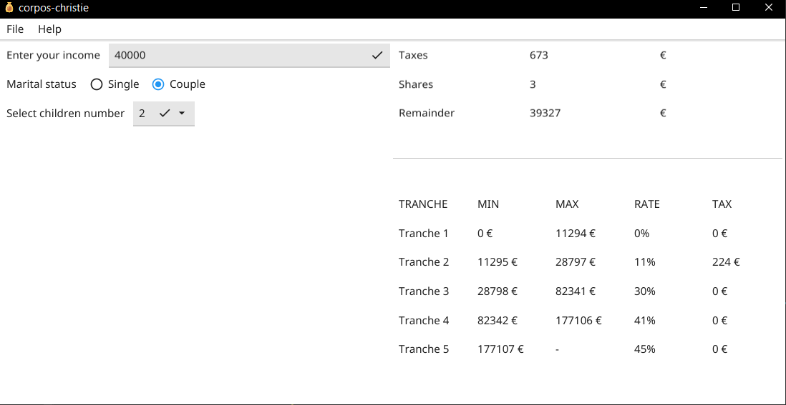
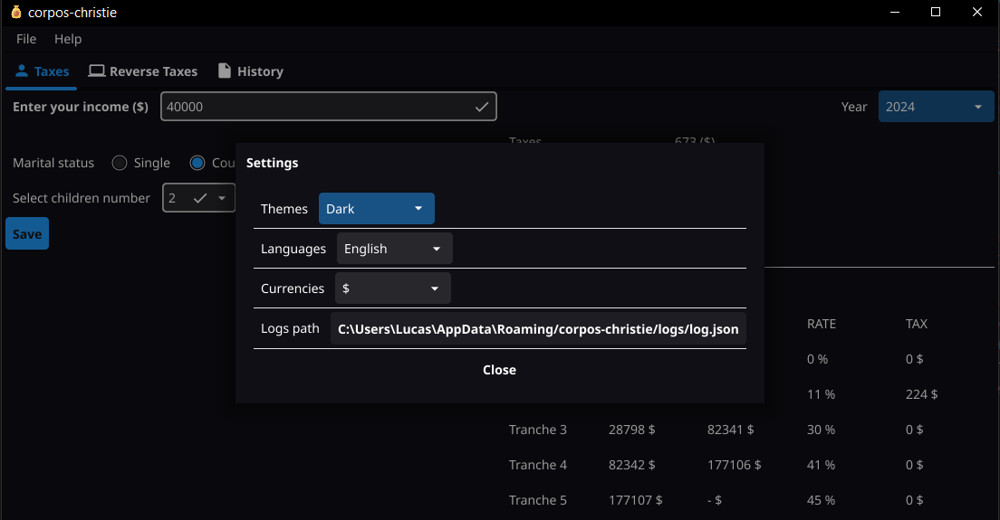
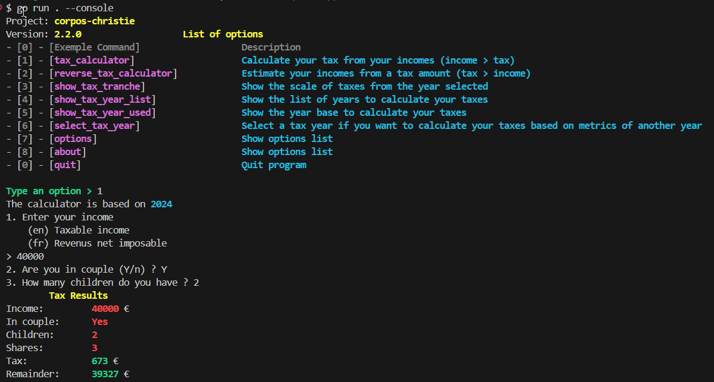

# Corpos-Christie

TODO changer les badges
TODO mettre codacy et deepsource
TODO retirer les fyne en wails
[](https://github.com/NY-Daystar/corpos-christie/actions)
[](https://www.gnu.org/licenses/gpl-3.0)
[](https://github.com/NY-Daystar/corpos-christie/releases)
[](https://godoc.org/github.com/NY-Daystar/corpos-christie)


 <a href="https://codeclimate.com/github/ny-daystar/corpos-christie/maintainability"></a>  


[](#contributors)


  


Console mode (Available until v2.1.0)  


This project is an income taxes calculator
which has been developped in Golang and wails for GUI which allows to calculate your taxes in the current year.

The government has created an explanatory sheet to understand the calculation of the tax rate but this calculation is relatively complex and we want to create a simpler interface to calculate things.  
Here's the sheet: https://www.economie.gouv.fr/particuliers/tranches-imposition-impot-revenu#etapescalculir

This project is a GUI developed with [Wails](https://wails.io/)

Source code analysed with [DeepSource](https://deepsource.com/) and [Codacy](app.codacy.com)

## Table of contents

TODO simplifier

- [Requirements](#requirements)
- [User Guide](#user-guide)
- [Get Started](#get-started)
    - [Setup hook git](#setup-githooks)
    - [Tests](#testing)
    - [Build application](#build-application)
- [Cve analysis](#cve-analysis)
- [Setup golang](#installing-and-setup-golang)
- [Suggestions](#suggestions)
- [Credits](#credits)

## Requirements

- [Golang](https://golang.org/dl/) >= 1.26.0
- [NodeJs](https://nodejs.org/en) >= 25.0.0

## User guide

TODO a changer

1. Get program  
   1.1 Linux

    ```bash
    wget https://github.com/NY-Daystar/Corpos-christie/releases/download/v3.2.0/linux-corpos-christie.zip -O corpos-christie.zip
    ```

    1.2 Windows

    ```bash
    wget https://github.com/NY-Daystar/Corpos-christie/releases/download/v3.2.0/windows-corpos-christie.zip -O corpos-christie.zip
    ```

    1.3 Mac

    ```bash
    wget https://github.com/NY-Daystar/corpos-christie/releases/download/v3.2.0/mac-corpos-christie.zip -O corpos-christie.zip
    ```

2. Unzip it

```bash
unzip corpos-christie.zip -d corpos-christie
```

3. Start program

```bash
cd corpos-christie
```

```bash
./corpos-christie
```

## Get Started

1. You need to install [golang](#installing-and-setup-golang)

2. Clone the repository

```bash
git clone https://github.com/NY-Daystar/corpos-christie.git
```

3. Install dependencies

```bash
go get
```

4. Launch program

```bash
wails dev
```

To see go doc (ex: tax package)

```bash
go doc github.com/NY-Daystar/corpos-christie/tax
```

### Setup githooks

1. To add git hook

```bash
git config --add core.hooksPath .githooks
```

### Testing

TODO a revoir
Inspired by: https://dev.to/ankitmalikg/how-to-write-unit-test-cases-for-golang-3ln0

To launch tests

```bash
go test ./...
```

### Build application

This app is developed with [wails](https://wails.io/)

```bash
wails build
```

## Cve analysis

CVE analyzed with [Go vulnerability Database](https://pkg.go.dev/vuln/)  
To setup :

```bash
go install golang.org/x/vuln/cmd/govulncheck@latest`
```

To launch analyzis

```bash
govulncheck ./...
```

To launch verbose analysis

```bash
govulncheck -show verbose ./...
```

## Installing and Setup Golang

To install golang on linux

```bash
wget https://golang.org/dl/go1.23.12.linux-amd64.tar.gz
tar -xvf go1.23.12.linux-amd64.tar.gz
sudo mv go /usr/lib
go version
```

## Suggestions

- To make a pull request: https://github.com/NY-Daystar/corpos-christie/pulls
- To summon an issue: https://github.com/NY-Daystar/corpos-christie/issues
- For any specific demand by mail: luc4snoga@gmail.com

## Credits

Made by Lucas Noga.  
Licensed under GPLv3.
